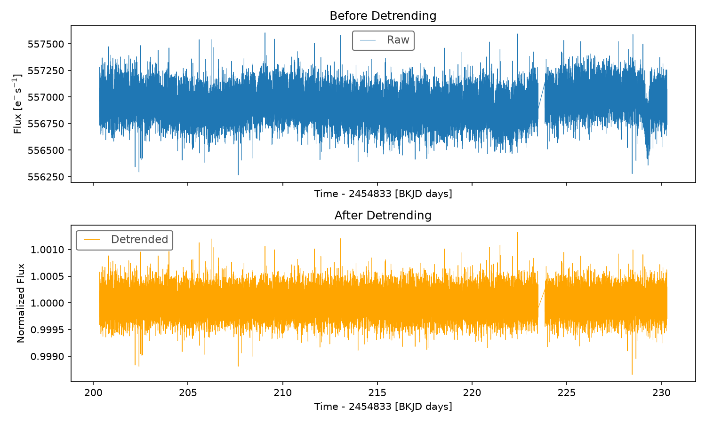

# Exoplanet Detection from Light Curves

A machine learning pipeline to detect exoplanet transits from stellar light curve data, combining classical transit-detection algorithms with a rule-based physical model and an ML classifier.

## Problem Statement

Exoplanets are often detected by observing periodic dips in a star's brightness caused by a planet transiting in front of it. This project builds an end-to-end pipeline to fetch light curve data, clean it, detect candidate transit signals, and classify genuine exoplanet transits from false positives.

## Tech Stack

- **Lightkurve** & **Astropy** — data fetching and detrending
- **Box Least Squares (BLS)** — periodic transit signal detection
- **batman** — physical transit model fitting
- **XGBoost** — class-weighted classification of genuine transits vs false positives

## Project Structure
exoplanet-detection-lightcurves/
├── data_pipeline/
│   ├── fetch_lightcurves.py   # Fetches light curve data via Lightkurve
│   └── detrend.py             # Removes noise/stellar variability
├── detection/
│   └── bls_transit_search.py  # BLS-based transit candidate detection
├── classification/
│   └── xgboost_classifier.py  # batman fitting + XGBoost classification
└── notebooks/                 # Exploration and experiments
## Status

- ✅ **Data pipeline** — fetching and detrending light curve data (done)
- 🚧 **Transit detection** — BLS-based candidate search (in progress)
- 🚧 **Classification** — transit fitting and XGBoost classification (in progress)
## Sample Output



## Setup

```bash
pip install -r requirements.txt
```

## Usage

```bash
python data_pipeline/fetch_lightcurves.py
python data_pipeline/detrend.py
```
